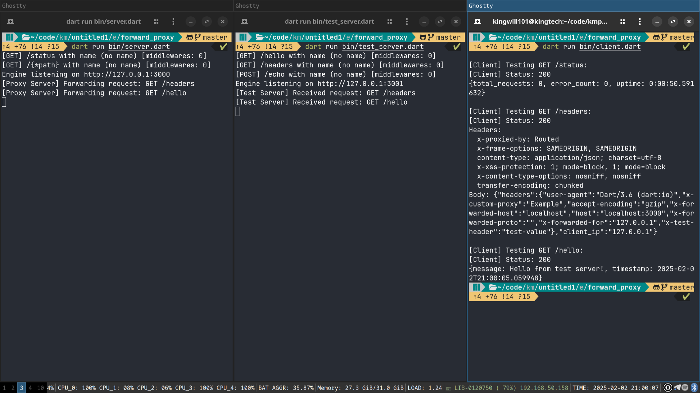

# Routed Forward Proxy Example

This example demonstrates how to create a forward proxy using the routed package.

## Features Demonstrated



### Proxy Features
- HTTP request forwarding
- Request header modification
- Response header handling
- Error handling
- Proxy authentication (optional)

## Running the Example

1. Start the test server:
```bash
dart run bin/test_server.dart
```

2. In another terminal, start the proxy server:
```bash
dart run bin/server.dart
```

3. In a third terminal, run the client:
```bash
dart run bin/client.dart
```

## Code Examples

### Basic Proxy Setup
```dart
engine.get('/*', (ctx) async {
  final targetUrl = 'https://api.example.com${ctx.request.path}';
  return await ctx.forward(targetUrl);
});
```

### Proxy with Header Modification
```dart
engine.get('/*', (ctx) async {
  ctx.setRequestHeader('X-Forwarded-For', ctx.request.ip);
  return await ctx.forward(targetUrl);
});
```

## API Endpoints

### GET /*
Forwards all requests to target server

### GET /status
Shows proxy status and statistics

## Response Examples

### Successful Proxy
```json
{
  "proxied_url": "https://api.example.com/data",
  "status": 200,
  "headers": {
    "content-type": "application/json",
    "x-forwarded-for": "127.0.0.1"
  }
}
```

### Proxy Error
```json
{
  "error": "Failed to connect to target server",
  "status": 502
}
```

## Code Structure

- `bin/server.dart`: Proxy server implementation
- `bin/client.dart`: Test client for proxy
- `pubspec.yaml`: Project dependencies
